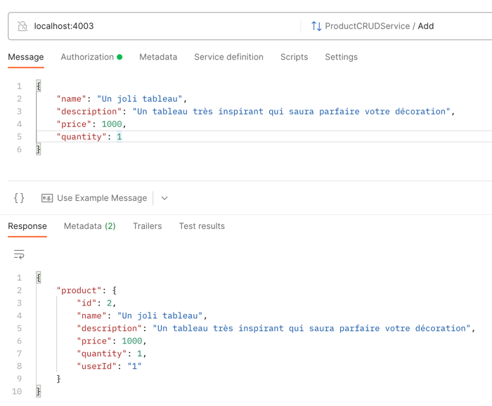
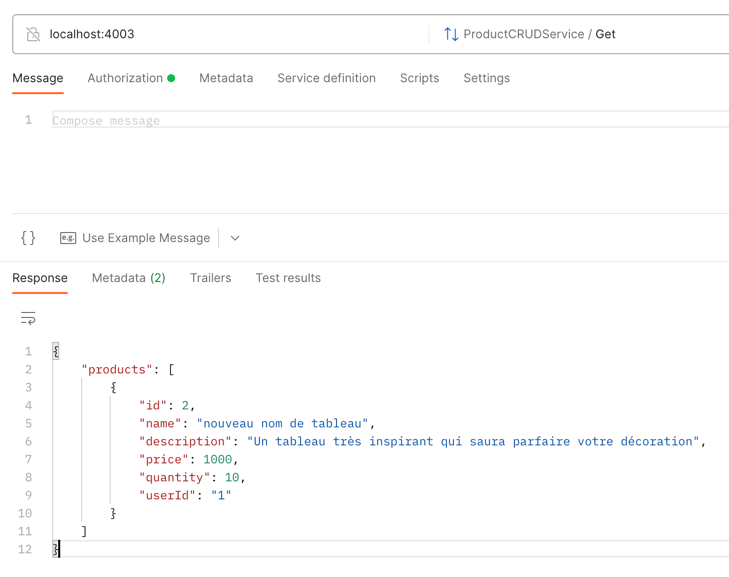
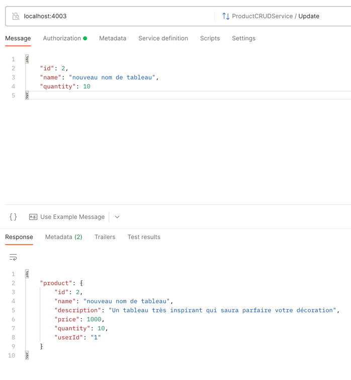
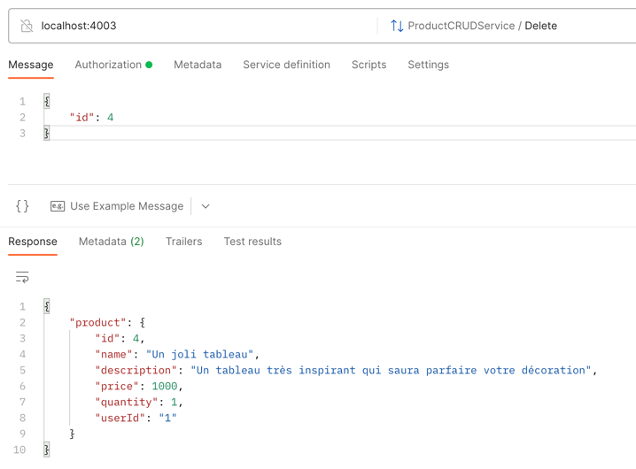
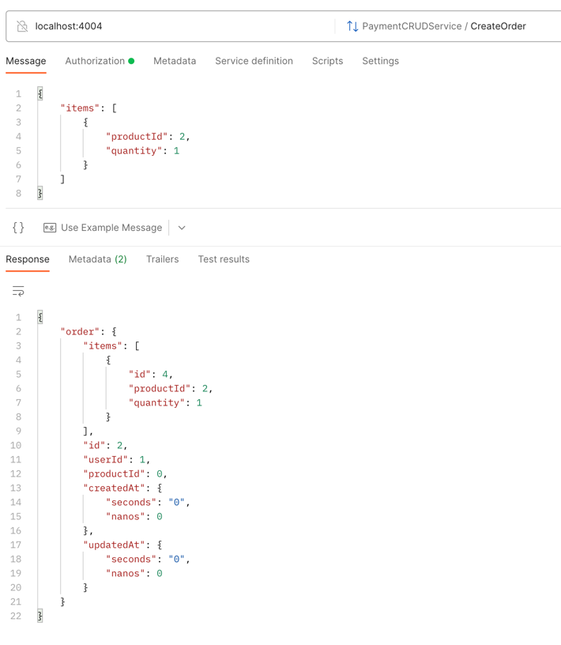
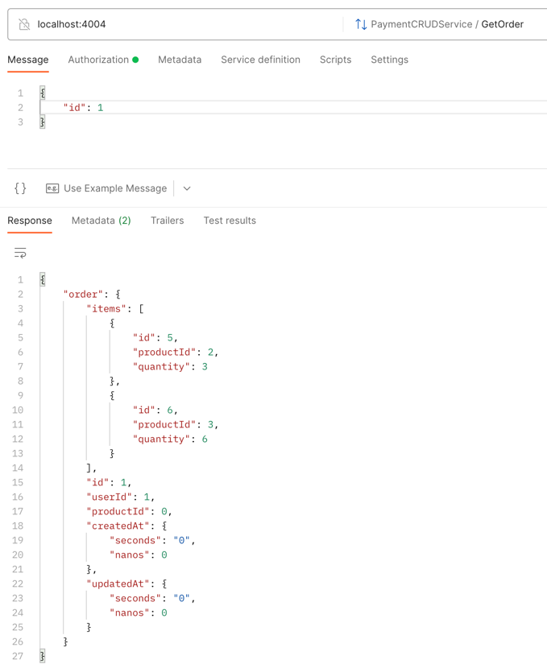
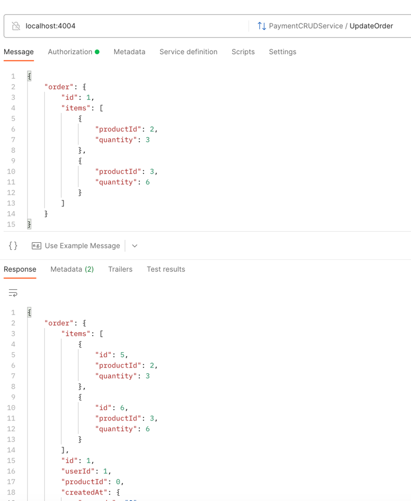
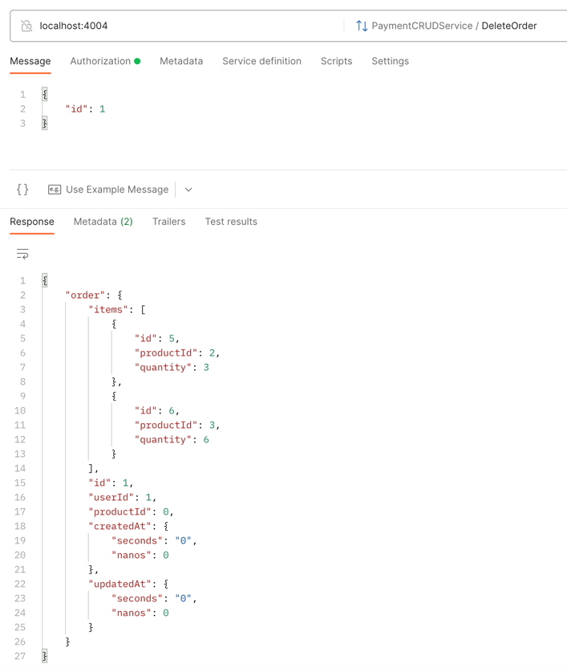

# What the project is

You can manage products by the product-api linked to the auth-api

You can manage orders by the payment-api linked to the auth-api and the product-api (to check stocks)

This project uses docker and GRPC interoperability between the services

# How to install
See the [readme.md](readme.md) for instructions on how to install the project.

# Product api
- Add product

Need to be logged in (bearer token)

- Get product

- Update product

Need to be logged in (bearer token)

- Delete product

Need to be logged in (bearer token)

# Payment api
- Create order

Need to be logged in (bearer token)

- Get order

Need to be logged in (bearer token) and be the owner of the order

- Update order

Need to be logged in (bearer token) and be the owner of the order

- Delete order

Need to be logged in (bearer token) and be the owner of the order
